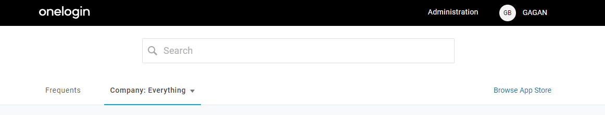
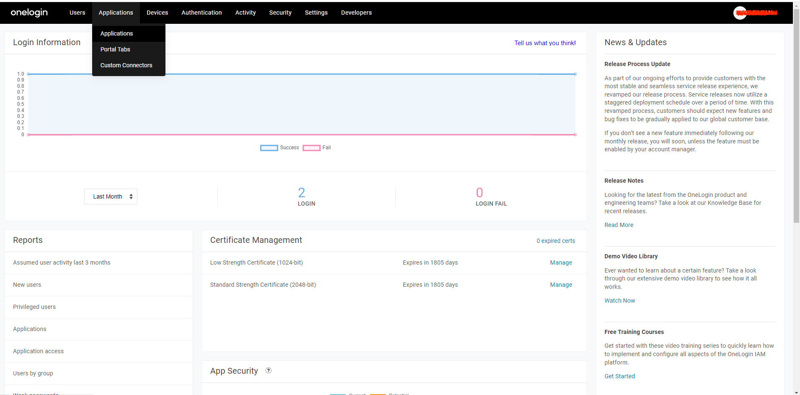
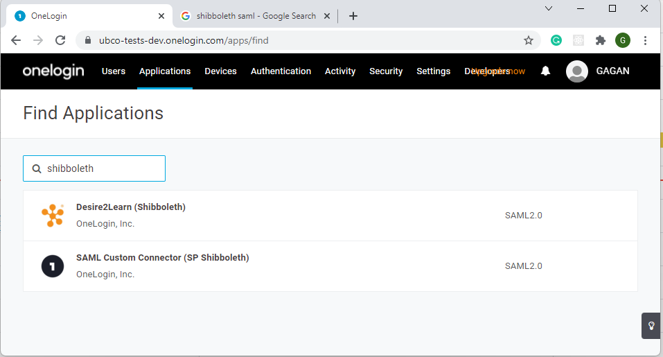
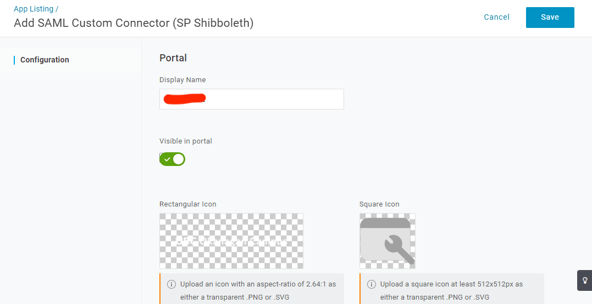
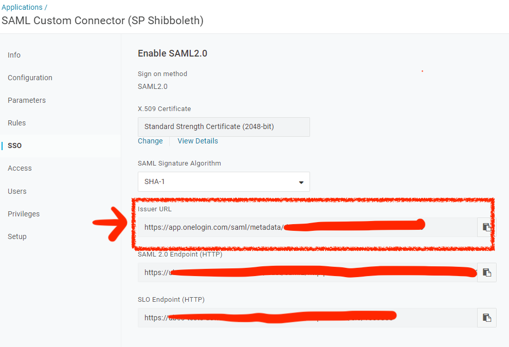

# Authentication Architecture

The diagram below was taken from the [**Developer Guide of AWS Cognito service**](https://docs.aws.amazon.com/cognito/latest/developerguide/cognito-user-pools-saml-idp-authentication.html)

Through a hostedUI provided by Cognito, the app can handle all the 
sign-in,sign-out requests and as well as getting all the attributes associated to the user from the external idp

## How to combine Cognito User pool with SAML Identity Provider
We will be focusing on the following:
 - How to create a SAML Identity Provider using OneLogin
 - How to setup the Cognito User Pool with SAML Identity Provider
 - How to configure the SAML Identity Provider to use the Cognito User Pool

Once the deployment of the backend and frontend of this app is finished, please head to
[**Cognito**](https://console.aws.amazon.com/cognito/home)

### Access User Pools
1. Click on 'Manage User Pools'
   
2. Select the User Pool which the student app is using
   

### Setup OneLogin for SAML

1. Go to [Onelogin](https://www.onelogin.com/developer-signup) and sign in
   

2. Once logged in go to applicatoions and click on 'Create Application'
   

3.  Click on `Add App` and from the next page seearch for `Shibboleth`
   

4. Add details for the application
   

5. Once setup is complete we will be able to see the SSO credetilas under the SSO tab
   

Note: The Issuer URL is the Url highlighted in the above image

### SAML Provider Setup
1. Click on 'Identity Providers' on the panel from the left side
   

2. Enter a descriptive name for your SAML provider
      and make sure checkbox 'Enable IdP sign out flow' is checked
   
3. Fill in the IDP metadata link or upload it
   

4. Once everything filled, click onto 'Create Provider'

We do not need to setup the attrirbute mapping for the SAML provider in the cognito user pool as it is already setup by default.

### App Client Setup

1. Click on 'App Clients' on the panel from the left side
   
2. Scroll down to the page and select 'Add another App client'
3. Make sure to uncheck 'Generate Client Secret' and feel free to leave all other settings as default
   
4. Scroll down and expand 'Set attribute read and write permissions'
   
   
5. Make sure all the attributes that you would like to receive in your app are checked on both sides
   
   
6. Once you are done, hit 'Create App Client'

7. Now, you should see your new app client and there is an App client id associated to it. Take a note of the id.

### App Client Settings

1. Go to App Client Settings
   
2. Check your identity providers under 'Enabled Identity Providers'
3. Give the Sign in and Sign out URLs. Only uses localhost for development purposes
   
4. Select the following options in OAuth Flows (checking implicit grant means you will receive a jwttoken (includes all user attributes in the call back uri when user logs in successfully))

### Hosted UI setup
We need to configure a hosted UI (provided by Cognito) for the user to sign-in/out 

First, let's create a domain name for the hosted UI
1. Go to Domain name on the left panel

   
2. You can use your own domain or use Cognito's domain for accessing the hosted ui
   
   
3. Now, you can go back to "App Client Settings" and click 'Launch Hosted UI' to test log in/log out
   

Congratulations, now you have finished setting up Cognito with SAML Identity Provider.

