# Authentication Architecture
<hr>

The diagram below was taken from the [**Developer Guide of AWS Cognito service**](https://docs.aws.amazon.com/cognito/latest/developerguide/cognito-user-pools-saml-idp-authentication.html)

Through a hostedUI provided by Cognito, the app can handle all the 
sign-in,sign-out requests and as well as getting all the attributes associated to the user from the external idp

<hr>

## How to combine Cognito User pool with external IDP
Since the setup for each external IDP is different, this document will just focus on the settings on AWS Cognito itself.

Once the deployment of the backend and frontend of this app is finished, please head to
[**Cognito**](https://console.aws.amazon.com/cognito/home)

### Access User Pools
1. Click on 'Manage User Pools'
   
2. Select the User Pool which the student app is using
   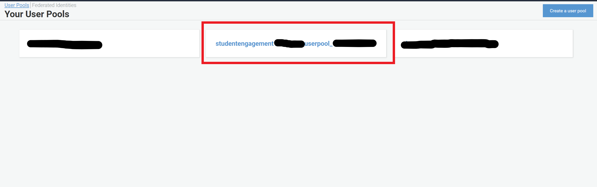

### SAML Provider Setup
1. Click on 'Identity Providers' on the panel from the left side
   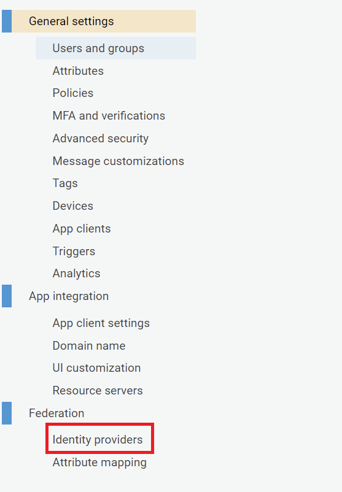

2. Enter a descriptive name for your SAML provider
      and make sure checkbox 'Enable IdP sign out flow' is checked
   
3. Fill in the IDP metadata link or upload it
   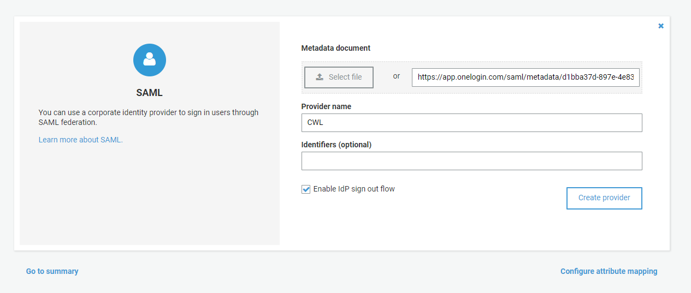
   
4. Once everything filled, click onto 'Create Provider'

### Attributes Creation

1. Now, we need to create the attributes that you are going to capture from your external idp in Cognito.
   Click on 'Attributes' on the panel from the left side
   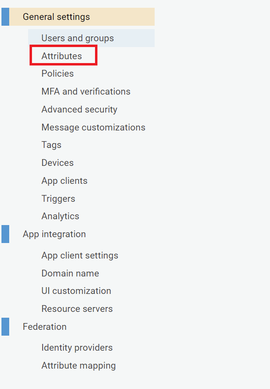
2. Click onto 'Add another attribute' to add all the attributes that you want to get from your external idp. Once you are done,
click on 'save changes'.
   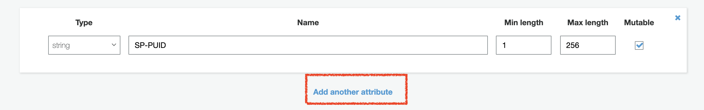

### Attributes Mapping
1. Click onto 'Attributes Mapping'
2. In the dropdown menu, make sure to select the SAML provider that you have just created
   In our case, the SAML provider name called 'MySamlProvider'
   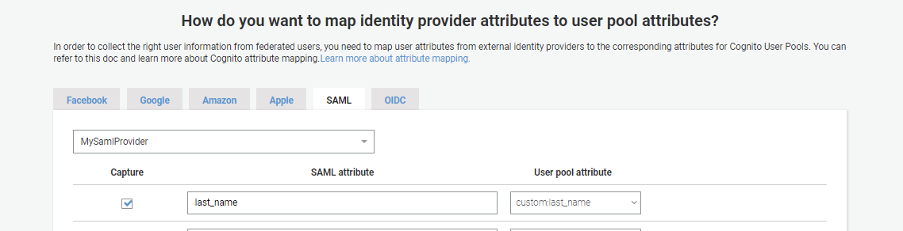
3. Click on 'Add SAML Attribute' to add a new attribute.
   Make sure the SAML attribute name is the same as the one in the external IDP
   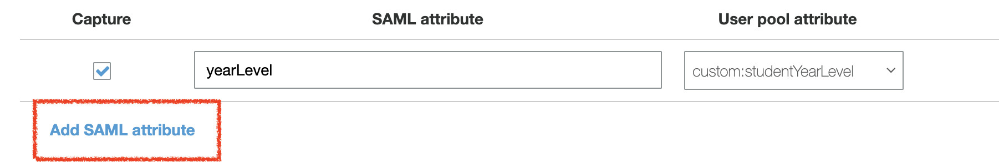
4. Once you are done, save you changes

### App Client Setup

1. Click on 'App Clients' on the panel from the left side
   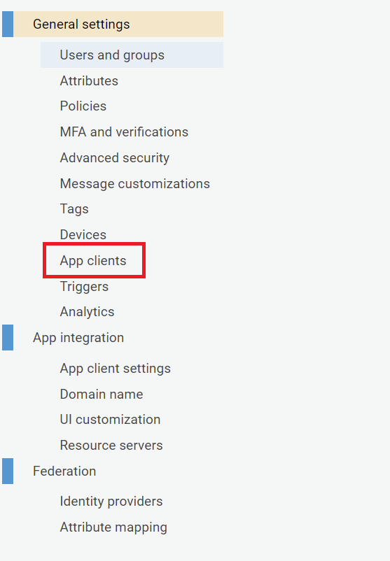
2. Scroll down to the page and select 'Add another App client'
3. Make sure to uncheck 'Generate Client Secret' and feel free to leave all other settings as default
   
4. Scroll down and expand 'Set attribute read and write permissions'
   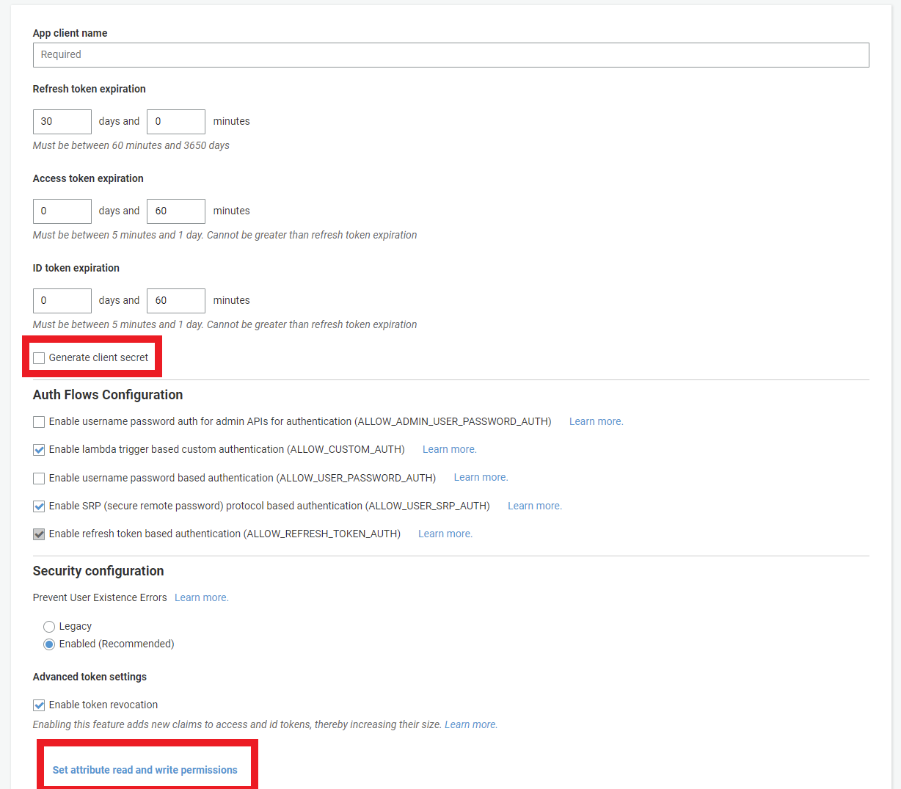
   
5. Make sure all the attributes that you would like to receive in your app are checked on both sides
   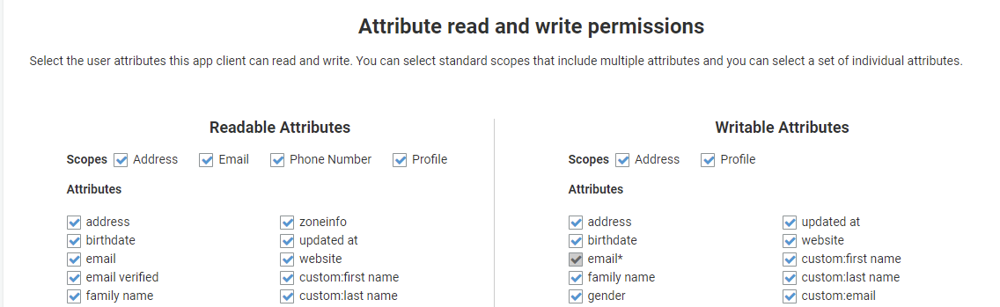
   
6. Once you are done, hit 'Create App Client'

7. Now, you should see your new app client and there is an App client id associated to it. Take a note of the id.


### App Client Settings

1. Go to App Client Settings
   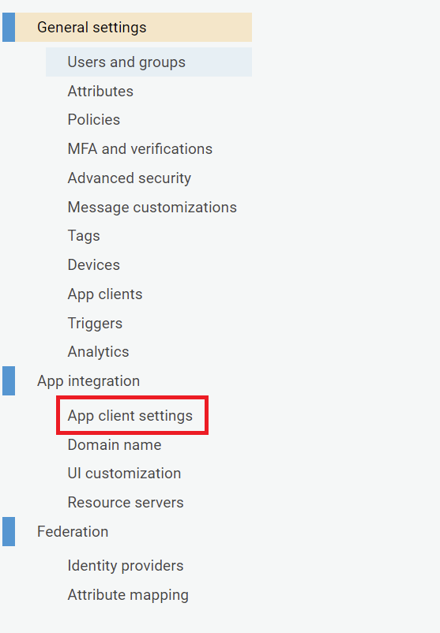
2. Check your identity providers under 'Enabled Identity Providers'
3. Give the Sign in and Sign out URLs. Only uses localhost for development purposes
   
4. Select the following options in OAuth Flows (checking implicit grant means you will receive a jwttoken (includes all user attributes in the call back uri when user logs in successfully))

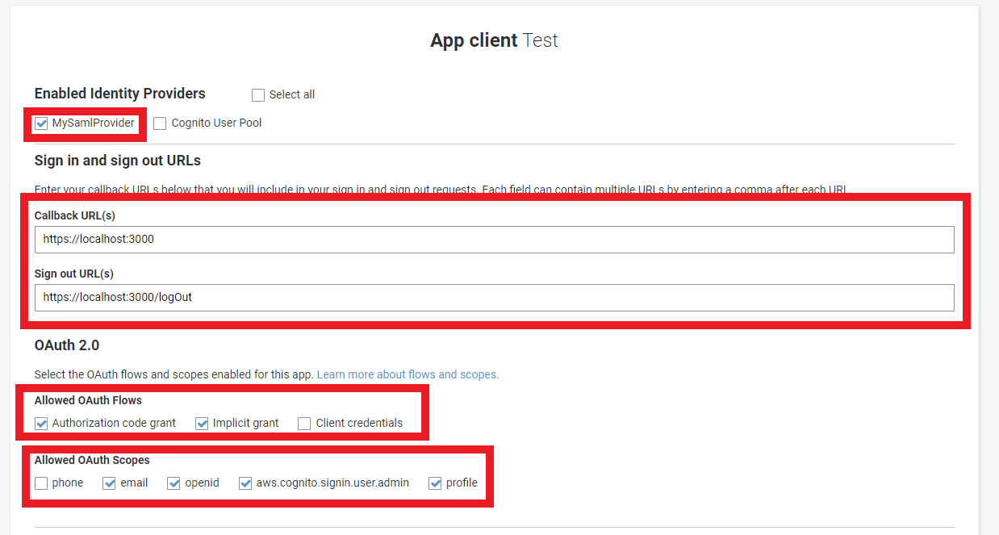


### Hosted UI setup
We need to configure a hosted UI (provided by Cognito) for the user to sign-in/out 

First, let's create a domain name for the hosted UI
1. Go to Domain name on the left panel

   
2. You can use your own domain or use Cognito's domain for accessing the hosted ui
   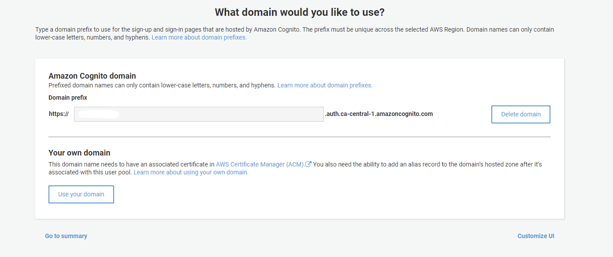
   
3. Now, you can go back to "App Client Settings" and click 'Launch Hosted UI' to test log in/log out
   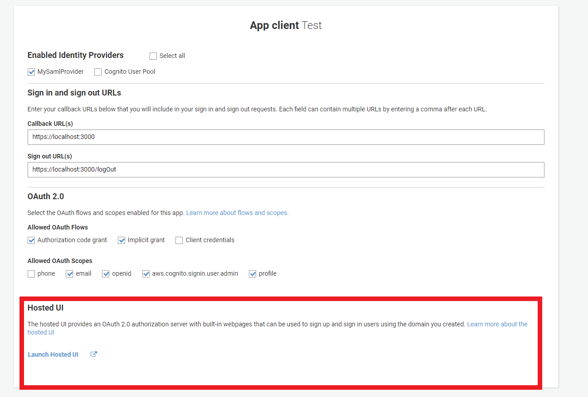

Congratulations, now you have finished setting up Cognito with an external IDP!

<hr>

## How to sign-in/sign out from the application itself

1.First, in order to sign in, you will need a button which redirects to the sign in url

The sign in url looks as follows:

SIGNIN_URL=`https://your_domain/login?response_type=token&client_id=your_app_client_id&redirect_uri=your_callback_url`

The button can be written like this:

`<Button href="SIGNIN_URL">Sign In </Button>`


2.Once the user has logged in, you can retrieve all the attributes and jwt token by importing Auth package from Amplify,

`import { Auth } from 'aws-amplify';`

Call `Auth.currentUser()` to retrieve all attributes and token

3.After you have retrieved the jwt token from step 2, you will need to use to token to access the AWS Cognito identity pool. The
identity pool manages the access to AWS resources from the authenticated user.

4. You will need to use the jwt token to get a temporary credential to access the AWS resources.
```
AWS.config.credentials = new AWS.CognitoIdentityCredentials({

// either IdentityPoolId or IdentityId is required
// See the IdentityPoolId param for AWS.CognitoIdentity.getID (linked below)
// See the IdentityId param for AWS.CognitoIdentity.getCredentialsForIdentity
// or AWS.CognitoIdentity.getOpenIdToken (linked below)
IdentityPoolId: 'us-east-1:1699ebc0-7900-4099-b910-2df94f52a030',
IdentityId: 'us-east-1:128d0a74-c82f-4553-916d-90053e4a8b0f'

// optional, only necessary when the identity pool is not configured
// to use IAM roles in the Amazon Cognito Console
// See the RoleArn param for AWS.STS.assumeRoleWithWebIdentity (linked below)
RoleArn: 'arn:aws:iam::1234567890:role/MYAPP-CognitoIdentity',

// optional tokens, used for authenticated login
// See the Logins param for AWS.CognitoIdentity.getID (linked below)
Logins: {
'graph.facebook.com': 'FBTOKEN',
'www.amazon.com': 'AMAZONTOKEN',
'accounts.google.com': 'GOOGLETOKEN',
'api.twitter.com': 'TWITTERTOKEN',
'www.digits.com': 'DIGITSTOKEN'
},

// optional name, defaults to web-identity
// See the RoleSessionName param for AWS.STS.assumeRoleWithWebIdentity (linked below)
RoleSessionName: 'web',

// optional, only necessary when application runs in a browser
// and multiple users are signed in at once, used for caching
LoginId: 'example@gmail.com'

}, {
// optionally provide configuration to apply to the underlying service clients
// if configuration is not provided, then configuration will be pulled from AWS.config

// region should match the region your identity pool is located in
region: 'us-east-1',

// specify timeout options
httpOptions: {
timeout: 100
}
});
```


5.To sign out, please have a button that redirects to the sign out URL (this url can be found in the step 3 of section 'App Client Settings' of this document).

The sign in url might look as follows:

SIGNOUT_URL=`https://localhost:3000/logOut`

The button can be written like this:

`<Button href="SIGNOUT_URL">Sign Out </Button>`


