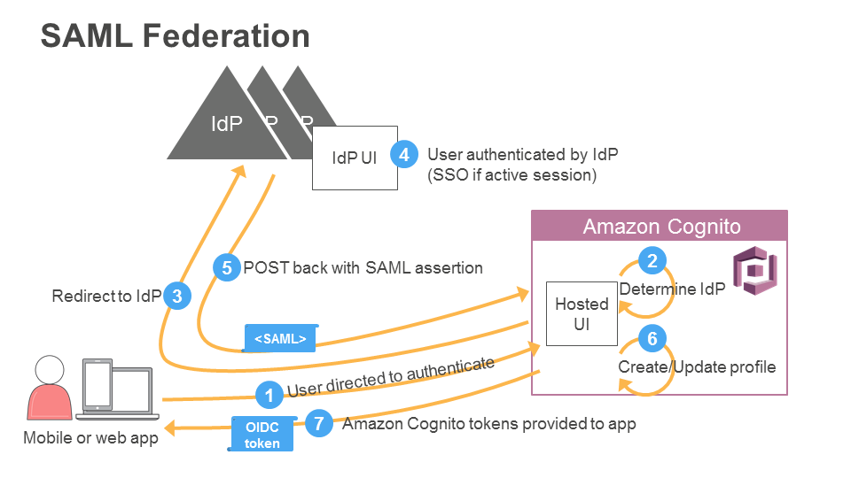

# Backend Architecture

## Authentication Flow
The diagram below was taken from the [**Developer Guide of AWS Cognito service**](https://docs.aws.amazon.com/cognito/latest/developerguide/cognito-user-pools-saml-idp-authentication.html)

##How to combine Cognito User pool with external IDP
