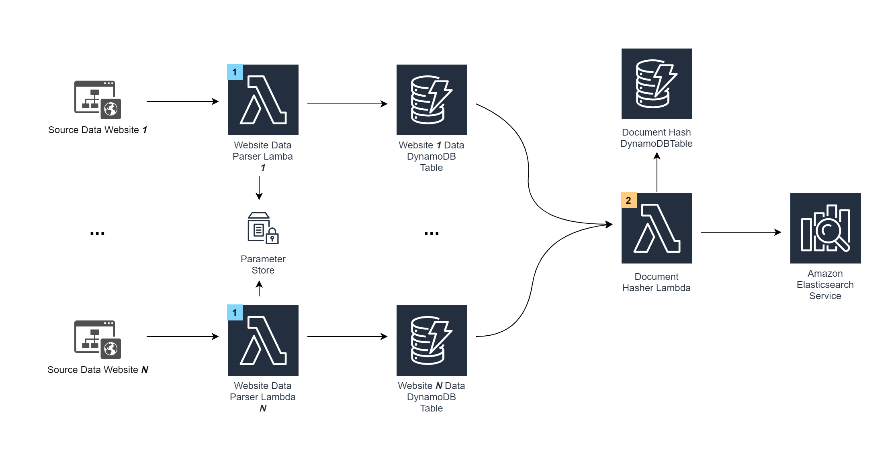

# Backend Architecture
<hr>

## Data Aggregation

Here is a diagram representing the processing flow for data aggregation from websites with desired content:



The workflow is as follows:

* A Lambda function (marked by the blue `1`) is designed to gather desired data from a source, and persist it 
  into a DynamoDB Table. Let's refer to the list of data items obtained from the website as documents henceforth
  The Lambda performs the following tasks:
  - Parses raw, unstructured documents into a semi-structured document format, while making sure it has a 
    unique identifier. The schema for the semi-structure data is detailed below in
    the **Database Schemas** section
    
  - Sets up a Time-To-Live for the document if necessary
    
  - The time of the last web data fetch is saved into AWS SSM Parameter Store. This time is retrieved and used to filter
    the web data fetch response to get a list of documents that are new from the response. Hence, this avoids overwriting 
    already existing data in DynamoDB
    
  - Adds the new, parsed data to the website's specific DynamoDB table. If the document only has one or more modified
    values, the corresponding document is updated based on the unique document ID which (by an assumption or fact) 
    does not change. This ensures the documents are upto-date, reflecting any changes made by the web content
    
* For every data source, a subsequent data parser Lambda can be added along with a DynamoDB table to store the intermediate results
  before it is used for recommendation and analytics
  
* The data is then ingested into Amazon Elasticsearch service by the help of:
  - A DynamoDB table that contains a list of hashes and data source name for all documents in Elasticsearch.
    The document hash represents the id of a item in Elasticsearch, e.g: 
    ```json
    {
      "documentHash": "0106aafb1262b33ef02e37f090cde0f3",
      "documentType": "Clubs"
    }
    ```
    
  - A Lambda function that updates data in the Document Hash DynamoDB Table and Elasticsearch
  
* The Lambda function (marked by the orange `2`) is designed to iterate through the ***N*** Website Data DynamoDB tables 
  and add them to Elasticsearch for recommendation purposes. It does so by doing the following:
  - Creates a hash out of the entire document string for all document items in the Website Data DynamoDB tables,
    thereby creating a list of hashes (L1). This list represents items present in the website.
    
  - Get a list of all document hashes (L2) from the Document Hash DynamoDB Table for the particular document type.
    This list represents items present in Elasticsearch
    
  - Compare the list L1 and L2.
    - If a hash is in L2 but not in L1, that means a document is outdated since it does not match what is present in the 
    website. Hence, delete the item from the DynamoDB table and Elasticsearch using the hash which identifies them.
    - If a  hash is in L1 but not in L2, that means there is a new document in the website. Hence, add the hash for that
    to the DynamoDB table and the document itself with the hash as id to Elasticsearch
      
  This makes sure any small change to a document on the website is accurately reflected into Elasticsearch, and hence
  the recommendation feeds as well


## Database Schemas
<hr>

Here are the schema outlines for the different DynamoDB Tables.
They are not final yet and can be modified as needed to simplify keys or remove information that is not necessary.
All attribute names are in camelCase standard.

### Events Schema
<hr>

```
{
  "eventId": The unique ID for the event,
  "status": All events have "publish" as status so probably whether published or not,
  "dateModified": Last modification date,
  "link": Link to the page on events.ok.ubc.ca,
  "title": Event Title, may include unicode characters in "\uXXXX" format where XXXX is a 4 digit hex code,
  "description": The entire event description, includes HTML Tags,
  "excerpt": Shorter form of the description with HTML Tags,
  "fullImage": Link to event image in full resolution in string format, False if no image included 
  "thumbnailImage": Link to event image in thumbnail resolution in string format, False if no image included 
  "allDay": Boolean representing whether the event is all day or not,
  "startDate": Event start time in "YYYY-MM-DD HH:MM:SS",
  "endDate": Event end time in "YYYY-MM-DD HH:MM:SS",
  "cost": Cost for event in Canadian dollars,
  "expiresOn": Document expiry date in Unix time, based on DateModified field and EventExpiryOffset specified a Cloudformation deployment parameter
  "categories": [
    List of strings that describe the categories the event falls under
  ],
  "eventLocation": {         // Location for the event. If the event is online, venue key will be "online" and no other keys present
    "venue": Name of building/Location for venue,
    "address": Street Address,
    "city": Name of city,
    "country": Name of country,
    "province": Name of province,
    "zip": Postal Code
  }
}
```

For Example,

```json
{
  "eventId": 11276,
  "status": "publish",
  "dateModified": "2021-04-13 10:02:13",
  "link": "https://events.ok.ubc.ca/event/stand-up-paddle-boarding-lessons/2021-05-23/",
  "title": "Stand-up Paddle Boarding Lessons",
  "description": "<p>Paddle boarding lessons at Kelowna Paddle Centre available from May &#8211; September!</p>\n<p>Learn a new summer activity, or improve your paddle boarding skills so you can be more comfortable on the water this year!</p>\n<p>Each session will consist of 3 lessons that occur each Sunday from 1 &#8211; 2:30 pm. Cost is $45.00 for students and $65.00 for staff.</p>\n<p>Participants are responsible for their transportation to and from Kelowna Paddle Centre on Abbott Street.</p>\n<p><a class=\"btn ok-btn-primary\" href=\"https://ca.apm.activecommunities.com/ubcokanagan/Activity_Search/25772\" target=\"_blank\" rel=\"noopener\">REGISTER NOW</a></p>\n<p>Session 1: May 9, 16, and 23</p>\n<p>Session 2: June 6, 13, and 20</p>\n<p>Session 3: July 11, 18, and 25</p>\n<p>Session 4: August 8, 15, and 22</p>\n<p>Session 5: September 12, 19, and 26</p>\n<p>&nbsp;</p>",
  "excerpt": "<p>Paddle boarding lessons at Kelowna Paddle Centre available from May &#8211; September!</p>",
  "fullImage": "https://events.cms.ok.ubc.ca/wp-content/uploads/sites/121/2021/04/matt-zhou-22qZVcUgD_U-unsplash-1-1-scaled.jpg",
  "thumbnailImage": "https://events.cms.ok.ubc.ca/wp-content/uploads/sites/121/2021/04/matt-zhou-22qZVcUgD_U-unsplash-1-1-300x200.jpg",
  "all_day": false,
  "start_date": "2021-05-23 13:00:00",
  "end_date": "2021-05-23 14:30:00",
  "cost": "$45.00",
  "expiresOn": 1626436800,
  "categories": [
    "Recreation"
  ],
  "event_location": {
    "venue": "Kelowna Paddle Centre",
    "address": "3020 Abbott Street",
    "city": "Kelowna",
    "country": "Canada",
    "province": "BC",
    "zip": "V1Y 1G9"
  }
}
```

### Blog Posts Schema
<hr>

```
{
  "blogId": Unique ID for the Blog,
  "title": Blog Title,
  "date": Blog publish date in format "YYYY-MM-DD HH:MM:SS",
  "link": Link to the blog post on students.ok.ubc.ca,
  "categories": [
    List of strings representing the categories the blog falls under
  ],
  "expiresOn": Document expiry date in Unix time, based on DateModified field and BlogsExpiryOffset specified a Cloudformation deployment parameter
  "excerpt": Small description about the blog post, includes HTML Tags,
  "mediaImages": {    // Contains thumnbail images if the blog post has a cover image attached. Empty array if no image attached
    "fullImage": Link to full-sized image,
    "mediumImage": Link the medium size crop of the cover image, medium as defined by Wordpress
  }
}
```

For Example,

```json
  {
    "blogId": 23830,
    "title": "Supporting your mental health during COVID-19",
    "date": "2020-03-20 11:42:30",
    "link": "https://students.ok.ubc.ca/?p=23830",
    "categories": [
      "UBCO Life"
    ],
    "expiresOn": 1626436800,
    "excerpt": "<p>Get familiar with some of the online resources available to help you stay mentally and physically healthy.</p>\n",
    "mediaImages": {
      "fullImage": "https://students.cms.ok.ubc.ca/wp-content/uploads/sites/90/2020/03/IMGP3690.jpg",
      "mediumImage": "https://students.cms.ok.ubc.ca/wp-content/uploads/sites/90/2020/03/IMGP3690-300x199.jpg"
    }
  }
```

### News Schema
<hr>

```
{
  "newsId": Unique ID for the News post,
  "title": News title, may contain unicode characters in "\uXXXX" format where XXXX is a 4 digit hex code,
  "link": Link to the news article on news.ok.ubc.ca,
  "categories": [
    String list of categories the news article falls under
  ],
  "expiresOn": Document expiry date in Unix time, based on DateModified field and NewsExpiryOffset specified a Cloudformation deployment parameter
  "summary": Short description of the article, may also contain unicode characters in "\uXXXX" format,
  "dateModified": Date of publishing in the sample format, "YYYY-MM-DD HH:MM:SS",
  "mediaThumbnail": [              // Will only contain one image
    {
      "url": Link to a medium sized cover image for the article,
      "width": Image width in pixels,
      "height": Image height in pixels
    }
  ]
}
```

For Example,

```json
  {
    "newsId": "19171",
    "title": "UBCO researcher uses geology to help astronomers find habitable planets",
    "link": "https://news.ok.ubc.ca/?p=19171",
    "categories": [
      "Media Releases",
      "Spotlight",
      "Geology",
      "Irving K. Barber Faculty of Science",
      "Research"
    ],
    "expiresOn": 1626436800,
    "summary": "Astronomers have identified more than 4,000, and counting, confirmed exoplanets \u2014 planets orbiting stars other than the sun \u2014 but only a fraction have the potential to sustain life.",
    "dateModified": "2021-05-04 14:00:22",
    "mediaThumbnail": [
      {
        "url": "https://news.ok.ubc.ca/wp-content/uploads/2021/04/earth-1200-225x225.jpg",
        "width": "225",
        "height": "225"
      }
    ]
  }
```

### Clubs and Course Union Schema
<hr>

```
{
  "clubId": MD5 Hash for the club created from its title
  "title": Title for the club,
  "imageLink": Link to the club cover image on ubcsuo.ca,
  "description": Description for the club. May contain additional links to their portals such as Instagram, Youtube or LinkedIn,
  "email": Email address for the club. This key is always present,
  "facebook": Facebook link to the club's portal. This key is optional,
  "categories": String list of category tags, manually created for optimal prototype functionality,
  "twitter": Twitter link for the club. This key is optional,
  "website": Website the for the club. This key is optional
}
```

For Example,

```json
  {
    "clubId": "sdgnk235sdgn23sd0of",
    "title": "Enactus UBCO",
    "imageLink": "https://www.ubcsuo.ca/sites/default/files/styles/club_image/public/clubs/enactus-logo-clipart-2_1.png?itok=qDOLxGOz",
    "description": "Enactus is a combination of 3 words that help tell the story of the organization. 'En' stands for 'entrepreneurial' because we use the entrepreneurial spirit to see opportunity in problems and create\nsolutions. 'Act' stands for 'action.' This is because Enactus students don't just talk about what they\nwish we could do; we take action to improve the world around us. The end of the word, 'us' represents\nthe organization as a group of students, educators business leaders who all work together to change the\nworld. Enactus has an important focus on the development of its student members. As members we are\nable to network with business leaders and learn up-to-date business and leadership skills at training\nconferences that are held throughout the year by the Enactus organization. Our projects allow us to step\noutside the comfort of the classroom to apply our knowledge to real solutions that affect real people.\nThis hands-on learning approach is key as we seek opportunities, brainstorm solutions and carry them\nout. When you join Enactus, you are not just in another student organization. You are applying the skills\nyou have learned in class to positively impact the world. In organizing and carrying out projects, we\nbrainstorm ideas, work as a team and can develop leadership skills. At competitions, we get practice in\npublic speaking and networking.",
    "facebook": "https://www.facebook.com/enactusubco/",
    "categories": ["Business", "Activism"],
    "email": "enactus.ubcok@gmail.com",
    "website": "http://www.enactusubco.ca/"
  }
```

## Elasticsearch Schema
<hr>

The documents in Elasticsearch have the same schema as the individual Website Data DynamoDB tables, with the addition
of a few more fields.

```
{
  "_index": The Elasticsearch index where the document is stored,
  "_id": MD5 hash created from the entire DynamoDB item,
  "_type": Of type _doc by default,
  "_version": Integer indicating the version for the document,
  "_score": Elasticsearch document score
  "_source":  JSON object which is the entire document from DynamoDB
}
```

For Example,
```json
{
  "_index": "events",
  "_type": "_doc",
  "_id": "e99644ae4d9cabd41076ff27455ab766",
  "_version": 1,
  "_score": 0,
  "_source": {
    "eventId": "11982",
    "expiresOn": 1637411400,
    "endDate": "2021-11-18 12:30:00",
    "status": "publish",
    "eventLocation": {
      "venue": "Online"
    },
    "allDay": false,
    "fullImage": [
      "https://events.cms.ok.ubc.ca/wp-content/uploads/sites/121/2021/06/image_guided_therapies_webinar_series_17.png"
    ],
    "cost": "",
    "categories": [
      "Materials and Manufacturing Research Institute (MMRI)",
      "Research and Innovation, Office of the Vice-Principal"
    ],
    "dateModified": "2021-06-08 13:31:57",
    "startDate": "2021-11-18 09:30:00",
    "link": "https://events.ok.ubc.ca/event/image-guided-therapeutics-and-diagnostics-symposium/2021-11-18/",
    "description": "<p><a href=\"https://bmiai.ubc.ca/image-guided-therapeutics-and-diagnostics-symposium\" target=\"_blank\" rel=\"noopener\">Image-Guided Therapeutics and Diagnostics </a>is a two-day symposium that will bring together clinicians, researchers, students, and industry organizations who are interested in emerging diagnostic and therapeutic health technologies.</p>\n<p>Besides keynote speakers, the symposium is also accepting abstracts to be reviewed and shortlisted for oral or poster presentation.</p>\n<p><a class=\"btn ok-btn-secondary\" href=\"https://www.eventbrite.com/e/image-guided-therapeutics-and-diagnostics-symposium-tickets-155982234061\" target=\"_blank\" rel=\"noopener\">Register Now</a></p>",
    "excerpt": "<p>This two-day symposium will bring together clinicians, researchers, students, and industry organizations who are interested in emerging diagnostic and therapeutic health technologies.</p>",
    "thumbnailImage": [
      "https://events.cms.ok.ubc.ca/wp-content/uploads/sites/121/2021/06/image_guided_therapies_webinar_series_17-150x150.png"
    ],
    "title": "Image-Guided Therapeutics and Diagnostics Symposium"
  }
}
```