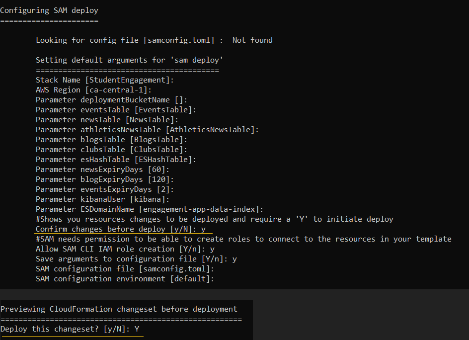
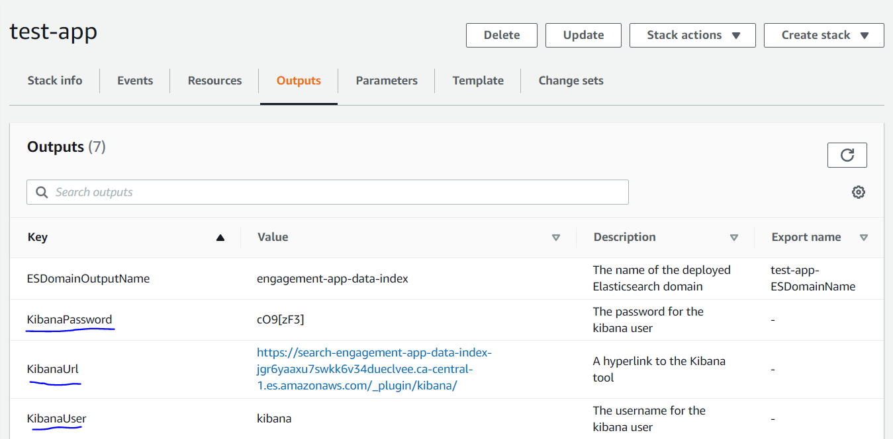
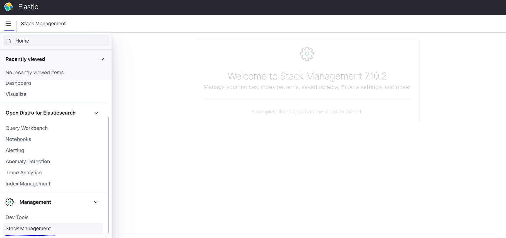
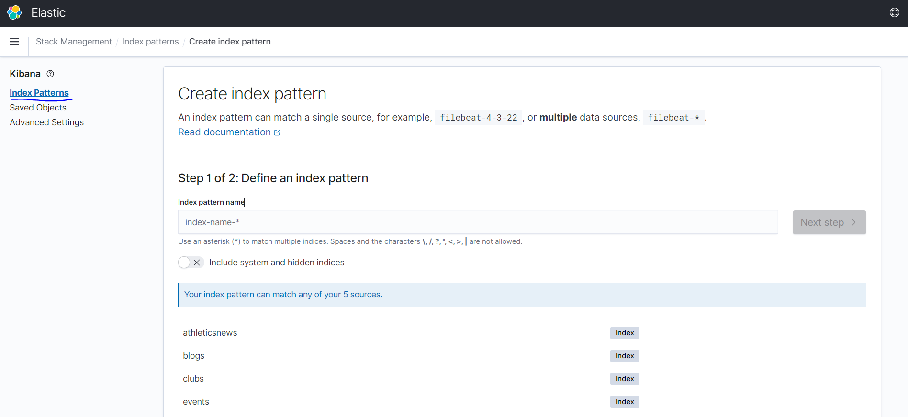
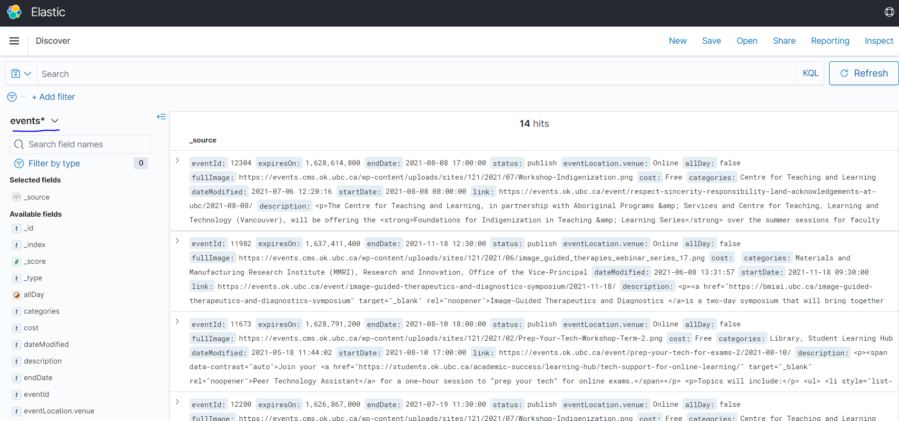

# Deployment Guide

To deploy this solution, deploy the ***backend*** first, and then the ***frontend***

## Backend Deployment
<hr/>

## Deployment Steps
The application can be deployed from either MacOS, Linux, Windows or Windows Subsystem for Linux.

Some system installation requirements before starting deployment:
* Have a copy of the repository downloaded into your local machine that you are running the deployment from
* AWS SAM installed and setup for use on your system, details on the installation can be found
  [here](https://docs.aws.amazon.com/serverless-application-model/latest/developerguide/serverless-sam-cli-install.html).
  (NOTE: The third step of installing Docker is only needed for testing the lambda functions in this app locally, it
  does not have to be installed for the sole purpose of deployment)
* Python3.8 or above installed and added to PATH (you can select this in the installer), download the
  installer [here](https://www.python.org/downloads/release/python-387/).
  NOTE: Run ```pip install wheel``` in the command line ***if*** there are any issues with ```sam build``` resolving dependencies in Step 1
  

1) Open the terminal at the root folder of the repository, and then run the deployment script using the following command using
   your own parameter values inside the angle brackets. The order of arguments must be the same as shown.

   For Mac, Linux and Windows Subsystem for Linux users:

   ```   
   deploy.sh --aws-profile <AWS_PROFILE> --aws-region <AWS_REGION> --stack-name <STACK_NAME>
   ```

   For Windows users:
   ```   
   deploy.bat aws-profile:<AWS_PROFILE> aws-region:<AWS_REGION> stack-name:<STACK_NAME>
   ```
    Where,
    * AWS_PROFILE: Name of the profile setup in your AWS config for the SAM CLI to use for deployment
    * AWS_REGION: AWS Region to deploy the application in
    * STACK_NAME: Name given to your application, only allows lower case a-z letters with the addition of numbers and hyphens.

   This script will:
   <ul>
   <li>make a copy of a python file into some lambda sub-folders for deployment</li>
   <li>use AWS SAM and Python to build the lambda functions and its dependencies</li>
   <li>package them into a deployment zip in a default, SAM-created S3 bucket</li>
   <li>and finally deploy them using the cloudformation template, template.yaml </li>
   </ul>
    
    After running the script, at one point it will run a guided SAM deployment:
   
    Pick the default options for each prompt, except for:
    
    ```
    Confirm changes before deploy [y/N]:
    ```   
    and
    ```
    Deploy this changeset? [y/N]:
    ```
    which will need either `y` or `Y` to confirm the deployment.
   Here are what all the deployment prompts look like for a proper deployment:
   
   This deployment step takes some time (about 20 minutes) due to creating the Elasticsearch domain, which itself takes
   about 15 minutes.
   
2) Once the deployment is complete, follow the next steps to have Kibana set up (a visualisation plugin for Elasticsearch)
    * Login to the AWS Console on a browser and visit the Cloudformation console. Find the application you deployed and 
      click on the **Outputs** tab.
      
        
    * Find the values for the KibanaUrl, KibanaUser and KibanaPassword. 
      Visit the KibanaUrl and login with the default Kibana Username (always set as `kibana`), and the pre-generated
      8 letter Kibana password. After logging in, it will prompt you to change the password.
      Keep this password noted, as it is not linked to any email for resetting, it exists as part of a Cognito User.
      
3) You can now verify that the deployment has worked properly by checking if the data has been persisted to Elasticsearch.
   * Click on the hamburger menu icon on the top left, and then scroll down to **Stack Management** and click on it.
   
   * Then click on **Index Patterns** on the left Menu and then **Create Index Pattern** 
   
   * Type in a valid index pattern (as of now, the valid options are `events`, `news`, `blogs`, `athleticsnews`, `clubs`**
   as these are the data sources we have), then click **Next Step** and proceed with the defaults to have the index setup.
   * Use the hamburger menu on the left and navigate to the **Discover** tab, then pick an index to visualise its data.
    
    If the deployment has proceeded perfectly, some data should be shown here:
    
   
4) ** This is a temporary step for this phase of the development. The club and course union website did not have categories
   for the clubs, so they were categorised via a non-programmatic manual process. Hence, they are manually added into the
   Elasticsearch index as this is not a part of the automatic data gathering process. To add the clubs data, the steps are:
   * Login to the AWS Console and visit the S3 console. Find the bucket named 
     `engagement-app-datastore-<AWS_REGION>-<AWS_ACCOUNT_ID>` and click on it
   * Drag and drop the `AllUBCOClubs.json` file in the `docs` folder of this repository to the S3 bucket, then click
    **Upload** at the bottom and leave all other options at default.
   * Now navigate to the Step Functions console, and find the State machine with the name 
     `DataGrabberStateMachine-XXXXXXXXXXXX`, then click on it      
   * Next click on **Start Execution** and enter the input as the following
    ```json
    {
        "dataType": "Clubs"
    }
    ```
   Once the Step Function execution is complete and successful, the clubs data should be present in Elasticsearch.
   Ideally this step should not be manual and should be automated, the details of achieving this are mentioned
   in the [Post Proof-of-Concept tasks](https://github.com/UBC-CIC/UBCO-StudentEngagementApp/blob/main/docs/DataAggregationArchitecture.md#post-proof-of-concept-tasks-for-backend-development)
       
   


## Frontend Deployment
<hr/>
