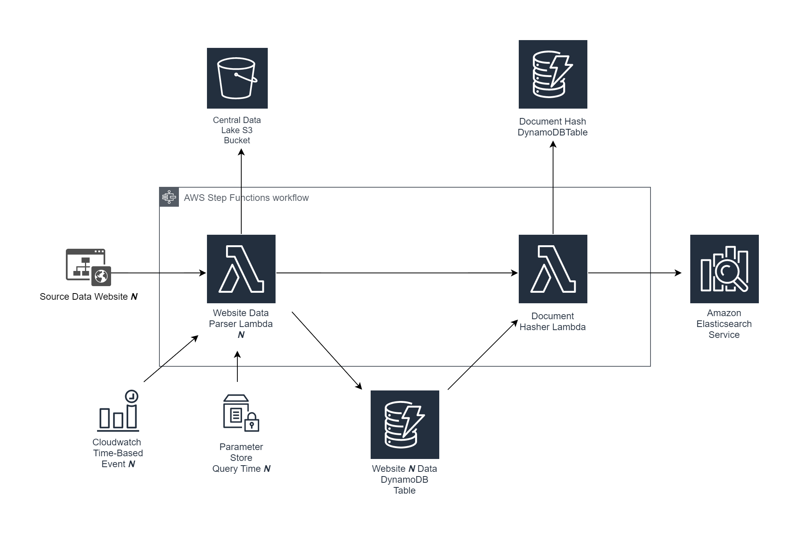
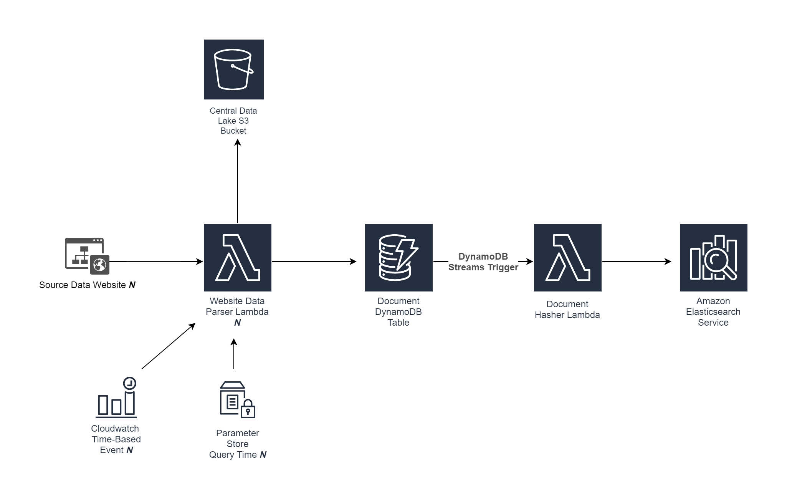

# DynamoDB Streams Aggregation

This branch contains an updated version of the data aggregation workflow, the difference in architecture is illustrated
below:

<h6 align="center">Old Data Aggregation Flow</h6>

* Previously, a Lambda function and DynamoDB table were used in conjunction to ensure data consistency between
  the website data DynamoDB table and Elasticsearch. This involved storing hashes of every item in Elasticsearch, hashing
  every website DynamoDB item and comparing it with all the Elasticsearch hashes everytime the Step Functions is invoked.

<h6 align="center">New Data Aggregation Flow</h6>

The backend in this branch uses a DynamoDB Streams design pattern for updating and archiving information, and a 
**single** Document DynamoDB Table that holds data across all websites that data is aggregated from

* Now, when data is **inserted** or **modified** in the Document DynamoDB Table, or deleted via the [Time-To-Live](https://docs.aws.amazon.com/amazondynamodb/latest/developerguide/TTL.html) 
  functionality, the data change is marked on DynamoDB streams, and the DocumentStreamHandler Lambda processes the change
  on a per item basis instead of looping through the entire database on DynamoDB and Elasticsearch.
  
To summarise, here are the changes and improvements:
* Data consistency between website DynamoDB Table and Elasticsearch is ensured by using DynamoDB Streams, and a Lambda
function that operates on the stream records.
* Step Functions is removed, the second Lambda is triggered from a DynamoDB Streams event.
* Cloudwatch Time-based Event triggers a Lambda function directly instead of Step Functions
* Website Data DynamoDB Tables are merged into one table.   
* Website Data DynamoDB Table uses a composite primary key with the documentId as sort key, and documentType as partition
    key so that items can be queried based on their document type (e.g getting only `events` labelled documents).
* Data consistency operation speed is improved by having the Lambda update values in Elasticsearch on a per-item basis 
  (instead of looping through all items) by operating on the DynamoDB streams records
* Data is aggregated for only two of the WordPress website sources in this version of the backend (UBCO Events page 
    and UBCO Student Life Blog)

This is the ideal data grabbing workflow that the app should aim to have, especially when all data source websites have
been finished rebuilding. Once that is complete, the frontend can be slightly reconfigured to work fully with the
frontend.

